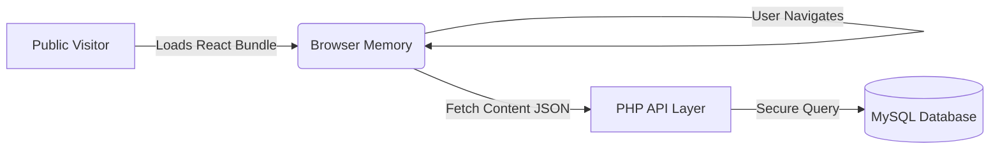

# Introduction to VonCMS

> **VonCMS v1.9.7 "Rafflesia"** | The Hybrid CMS Revolution

---

## ⚡ The Best of Both Worlds

VonCMS represents a paradigm shift in web development. We asked a simple question: **"Why can't we have the blazing speed of a Headless React app with the effortless hosting of WordPress?"**

The answer is **VonCMS**.

It effectively bridges the gap between modern technology and accessible infrastructure:
*   **For Users:** It feels like a native app. Instant transitions. Zero loading spinners.
*   **For Hosts:** It runs on standard PHP hosting ($2/month). No Node.js required.

---

## 💎 Why VonCMS?

### 1. Zero-Friction Performance
Traditional CMSs generate pages on the fly (slow). Headless CMSs require complex build pipelines (expensive).
VonCMS uses a **Pre-Compiled React Core** that loads instantly.
*   **Lighthouse Score:** 100/100 (Performance, SEO, Best Practices).
*   **Core Vital:** Largest Contentful Paint (LCP) under 0.8s.

### 2. "It Just Works" Philosophy
We believe you shouldn't need 20 plugins just to launch a blog.
*   **SEO?** Built-in.
*   **Analytics?** Built-in.
*   **Security?** Built-in.
*   **Backup?** Built-in.
*   **Dark Mode?** Built-in.

### 3. Premium by Design
Most CMS themes look generic. VonCMS ships with 5 **Agency-Grade Themes** crafted for specific industries:
*   **TechPress:** For serious journalism.
*   **Prism:** For modern tech blogs.
*   **Digest:** For lifestyle & culture.
*   **Portfolio:** For creatives.
*   **Default:** For minimalists.

---

## 🏗️ The Hybrid Architecture

Unlike WordPress (Monolithic) or Strapi (Headless), VonCMS is **Hybrid**.

1.  **Browser:** Loads the entire UI once. Navigation is instant (0ms latency).
2.  **Server:** PHP acts purely as a lightweight API. It creates no HTML, saving massive server CPU.
3.  **Result:** Your cheap shared hosting can handle 10x the traffic of a WordPress site.

---

## 🚀 Key Capabilities

### 🧠 Smart Intelligence (v1.9)
*   **Dark Mode Sniper:** Algorithmically cleans "dirty" colors from MS Word writes.
*   **Contextual SEO:** Auto-generates keywords based on Title weight, not just content density.

### 💰 Monetization First
*   **Native Ads Manager:** Inject ads into headers, sidebars, and *inside* content (e.g., "After Paragraph 3").
*   **Newsletter CRM:** Own your audience. Collect emails directly into your database. No Mailchimp fees.

### 🛡️ Enterprise Security
*   **Atomic Writes:** Configuration files use "Write-Verify-Swap" to prevent corruption.
*   **Honeypot Logic:** Invisible traps for bots in every form.
*   **Session Shield:** 30-minute auto-rotation and IP locking.

---

## 📚 Where to Start?

| I want to... | Guide |
|--------------|-------|
| **Deploy a Site** | [Installation Guide](INSTALLATION.md) |
| **Manage Content** | [User Manual](USER_MANUAL.md) |
| **Upgrade Version** | [Upgrade Guide](UPGRADE.md) |
| **Develop/Hack** | [API Reference](API_REFERENCE.md) |

---

*VonCMS v1.9.7 "Rafflesia" — Built for the Modern Web.*
