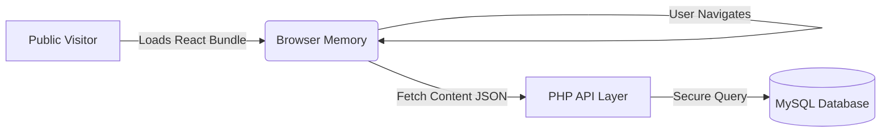

# Introduction to VonCMS

> **VonCMS v1.10.x "Solana"** | The Hybrid CMS Revolution

---

## ⚡ The Best of Both Worlds

VonCMS represents a paradigm shift in web development. We asked a simple question: **"Why can't we have the blazing speed of a Headless React app with the effortless hosting of WordPress?"**

The answer is **VonCMS**.

It effectively bridges the gap between modern technology and accessible infrastructure:

- **For Users:** It feels like a native app. Instant transitions. Zero loading spinners.
- **For Hosts:** It runs on standard PHP hosting ($2/month). No Node.js required.

---

## 🚀 Why Choose VonCMS?

> **"Battery Included"** — Install and run your business immediately. No plugin hunting, no hidden costs.

VonCMS was built to solve the frustration of "empty shell" CMS installations where you spend the first 3 hours searching for plugins just to get basic functionality. We include the premium essentials out of the box.

### 1. 💰 Built-in Moneymaker (Ads Manager)

**The Problem:** Most CMSs require complex, paid plugins just to place ads effectively.
**VonCMS Solution:** A native, dedicated Ads Manager built directly into the core settings.

- ✅ **Strategic Slots:** Pre-defined high-conversion spots (Header 728x90, Sidebar 300x250, In-Feed injection, Popup modals).
- ✅ **AdSense Ready:** Dedicated field for verification using native rendering (zero script bloat).
- ✅ **Performance:** Ads load instantly with the page, not after a delay.

### 2. 🛡️ Fortress-Grade Security (No Setup)

**The Problem:** Security plugins slow down your site and constantly nag you to upgrade to "Pro".
**VonCMS Solution:** Enterprise-grade security logic baked into the architecture.

- ✅ **Invisible Honeypot:** Smart traps for bots that humans never see (No Captchas needed!).
- ✅ **Intelligent Rate Limiting:** Brute-force attacks are cooled down automatically by IP.
- ✅ **Crypto-Signed Forms:** CSRF protection ensures hackers can't fake requests.

### 3. 📈 SEO & Marketing Powerhouse

**The Problem:** You build a site, but Google ignores it until you configure a complex SEO plugin.
**VonCMS Solution:** VonSEO is the engine, not an afterthought.

- ✅ **Zero-Config SEO:** Auto-generated Canonical URLs, Smart Meta Tags, and Sitemaps.
- ✅ **VonAnalytics:** Privacy-focused traffic stats without leaking user data.
- ✅ **Growth Tools:** Sticky Promo Bars and Engagement Widgets included free.

### 4. ⚡ "Use What's Provided" Philosophy

VonCMS is opinionated software. We give you the **best way** to do things, not 50 broken ways.

- ✅ **Hybrid Tech:** React 19 Frontend + PHP Backend. The speed of a Single Page App (SPA) with the ease of Shared Hosting.
- ✅ **Native Comments:** Nested replies and moderation without heavy external scripts (Disqus/Facebook).
- ✅ **System Dark Mode:** It's 2026. Dark mode isn't a plugin, it's a standard.

---

### Key Takeaway

With other CMSs, the "free" download is just the start of your payments.
With **VonCMS**, the download is the entire package.

**Start publishing. Start earning. Stop configuring.**

---

## 🏗️ The Hybrid Architecture

Unlike WordPress (Monolithic) or Strapi (Headless), VonCMS is **Hybrid**.

1.  **Browser:** Loads the entire UI once. Navigation is instant (0ms latency).
2.  **Server:** PHP acts purely as a lightweight API. It creates no HTML, saving massive server CPU.
3.  **Result:** Your cheap shared hosting can handle 10x the traffic of a WordPress site.

---

## 🚀 Key Capabilities

### 🧠 Smart Intelligence (v1.9)

- **Dark Mode Sniper:** Algorithmically cleans "dirty" colors from MS Word writes.
- **Contextual SEO:** Auto-generates keywords based on Title weight, not just content density.

### 💰 Monetization First

- **Native Ads Manager:** Inject ads into headers, sidebars, and _inside_ content (e.g., "After Paragraph 3").
- **Newsletter CRM:** Own your audience. Collect emails directly into your database. No Mailchimp fees.

### 🛡️ Enterprise Security

- **Atomic Writes:** Configuration files use "Write-Verify-Swap" to prevent corruption.
- **Honeypot Logic:** Invisible traps for bots in every form.
- **Session Shield:** 30-minute auto-rotation and IP locking.

---

## 📚 Where to Start?

| I want to...        | Guide                                 |
| ------------------- | ------------------------------------- |
| **Deploy a Site**   | [Installation Guide](INSTALLATION.md) |
| **Manage Content**  | [User Manual](USER_MANUAL.md)         |
| **Upgrade Version** | [Upgrade Guide](UPGRADE.md)           |
| **Develop/Hack**    | [API Reference](API_REFERENCE.md)     |

---

_VonCMS v1.10.x "Solana" — Built for the Modern Web._
